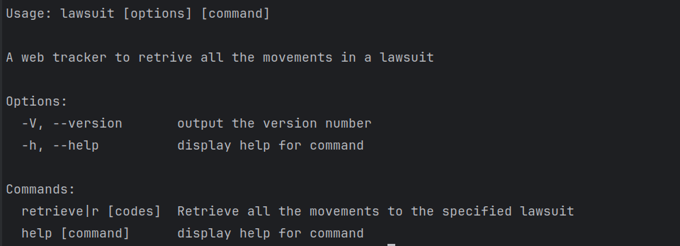

# Webscrap TJMG

This is a simple crawler to extract data from pje-consulta-publica.tjmg.jus.br

## Requirements
- Node Version 20 or major

Install project dependecies

```shell
npm install
```

## Usage
To use this crawler is very simple, it is a CLI



By default, the crawler starts with retrieve command.

The retrieve command accepts one or more lawsuit code

---

Example of usage:
```shell
node lawsuit 5044116-91.2023.8.13.0024 5002739-49.2023.8.13.0604
```

This command, retrieve all movimentations of the following lawsuits
- 5044116-91.2023.8.13.0024 
- 5002739-49.2023.8.13.0604

You can save all extracted data in a txt file, using this command

```shell
node lawsuit --save 5044116-91.2023.8.13.0024 5002739-49.2023.8.13.0604 
```
